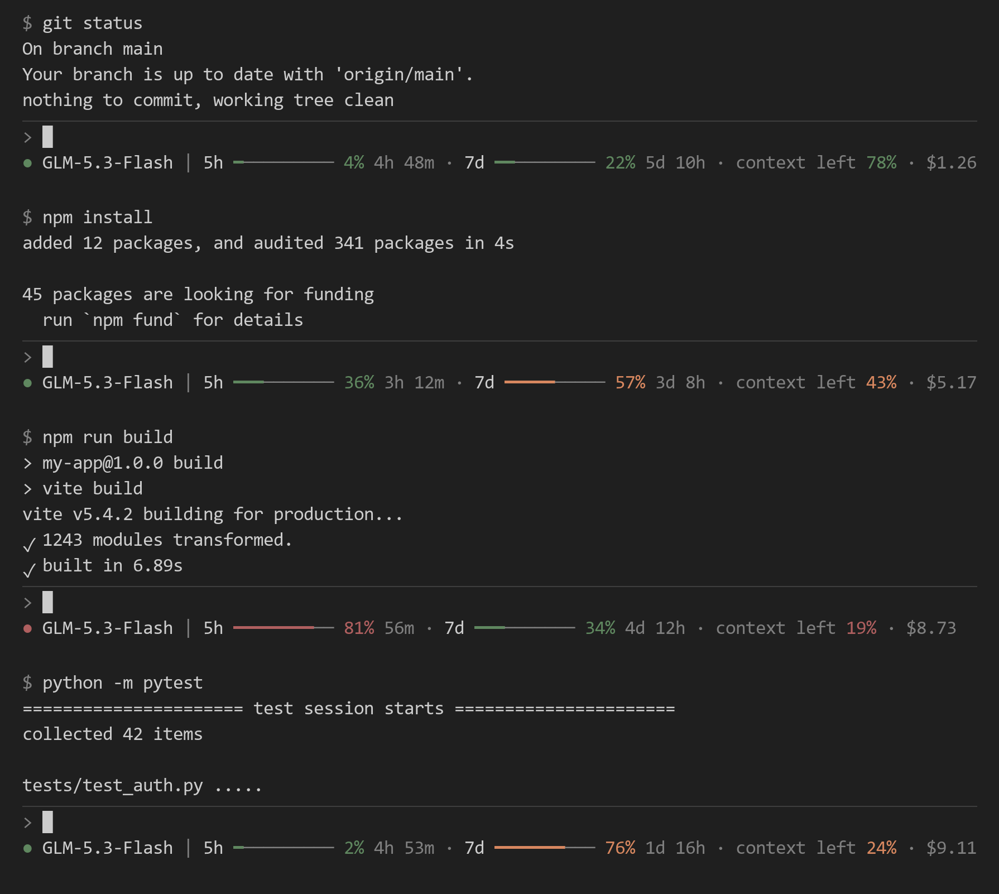

# Z.AI Quota Statusline for Claude Code

[](https://github.com/moriarthur/zai-quota-statusline/actions/workflows/ci.yml)
[](https://github.com/moriarthur/zai-quota-statusline/releases)
[](LICENSE)

Real-time Z.AI / GLM plan quota in [Claude Code](https://claude.com/claude-code)'s own
status line. **Event-driven: no cron, no quota polling, no browser dashboard** — the
cache refreshes the moment you submit a prompt and again when the turn finishes, and the
status line reads a local cache file.

<p align="center">
  
</p>
<p align="center"><i>One session, top to bottom: light use → the 5h window filling → minutes
from its limit → right after the 5h reset. Every statusline pixel above is the plugin's
real rendered ANSI output — generated by driving <code>zai-statusline.sh</code> itself, not
a mockup.</i></p>

<p align="center">
  
</p>
<p align="center"><i>While a turn is live the dot breathes — the hueless gray "off" end ↔ the
tier color, one second a tone: a full cycle every 2 s, the fastest flicker the host's 1 s
render floor allows. Idle, the dot rests on the tier color.</i></p>

- **5h and 7d plan windows** — bar, percent used, time to reset, colored by severity
  (green < 50 %, orange < 80 %, red ≥ 80 %)
- **Context left** — filtered against Claude Code's transient phantom-100 % frames
- **Session cost** — Claude Code's own list-price estimate (resets on `/clear`)
- **A model chip whose dot breathes while a turn is live** — like the native spinner
- Works on **macOS, Linux and WSL2**; no `jq` required; no Nerd Font required

**What it does not do:** it is not an official Z.AI or Anthropic product; it does not
switch models, manage your plan, or show the Z.AI billing invoice (the cost segment is
Claude Code's own estimate).

> **Before you install:** the plugin needs a Z.AI Coding Plan token and reads Z.AI's
> internal quota endpoint — not part of the documented Anthropic-compatible API. That
> endpoint can change without notice; everything else the plugin does is local.

## The line, piece by piece

```
● GLM-5.3-Flash | 5h ━━━━━━──── 60% 2h 14m · 7d ━━━━━━━─── 77% 4d 3h · context left 38% · $5.10
```

| Piece | Meaning |
|---|---|
| `● model` | The chip. The dot's color is the current 5h severity; while a turn is live it breathes gray ↔ tier color |
| `5h ▬ 60% 2h 14m` | 5-hour token window: usage bar, percent used, time until reset |
| `7d ▬ 77% 4d 3h` | Weekly token window, same format |
| `context left 38%` | Context window remaining; the payload's placeholder "100 %" is never shown (held or hidden), other rises ≥ 10 points wait for a confirming second frame |
| `$5.10` | Claude Code's client-side cost estimate for the session — **not** the Z.AI invoice |

## Requirements & compatibility

| | |
|---|---|
| **Platforms** | macOS, Linux, WSL2 (developed and tested on WSL2 + macOS). Native Windows is untested — use WSL |
| **Runtime** | `bash` 3.2+ (stock macOS bash works — no bash-4 features), `curl` 7.55+ (2017; any current distro — the token rides in a stdin-fed header, invisible to `ps`) |
| **JSON parser** | `jq` if present; otherwise the bundled `jqsh` fallback runs on `python3` (macOS: shipped with the Command Line Tools). Either one is enough |
| **Claude Code** | Any version with plugin-marketplace support and `statusLine.refreshInterval` (verified against 2.1.x) |
| **Terminals** | Any terminal Claude Code runs its UI in — Terminal.app, iTerm2, Windows Terminal, kitty, Alacritty, tmux, SSH, IDE-embedded terminals. Colors are explicit xterm-256 cube codes, so 256-color and truecolor render paths draw them identically (see the design note below) |
| **Fonts** | Stock fonts only — `●`, `━`, `─` are common Unicode glyphs; no Nerd Font |
| **IDEs** | The status line is a CLI feature: it appears wherever the interactive `claude` TUI runs, including the VS Code and JetBrains integrated terminals. Not applicable to claude.ai (web) |

> **Why 256-color palette codes?** Some terminal render paths (e.g. a TUI redrawing the
> status line through a 256-color backend) quantize any truecolor to the xterm cube —
> each channel snapped via `round(c/51)`. That rounding can push a dark red's green
> channel *up* until it renders brighter than the orange tier, visually inverting
> severity. Colors already on the cube are identity-mapped by such quantizers, so the
> status line looks the same everywhere: the tier colors `38;5;65/173/131`, and the
> busy dot breathing between a dim gray (`38;5;240`) and the tier color — explicit
> `38;5;N` codes rather than SGR faint, another attribute render paths drop.

## Install

Inside Claude Code (or from the shell — both do the same):

```bash
claude plugin marketplace add moriarthur/zai-quota-statusline
claude plugin install zai-quota-statusline@moriarthur
```

```
/plugin marketplace add moriarthur/zai-quota-statusline
/plugin install zai-quota-statusline@moriarthur
```

In short: **install → credentials → `statusLine` block → restart.** When it works, the
line under your prompt reads:

```
● GLM-5.3-Flash | 5h ━━────── 36% 3h 12m · 7d ━━━━━───── 57% 3d 8h · context left 43% · $5.17
```

**Step 1 — credentials.** Point a credentials file at your Z.AI token:

```bash
mkdir -p ~/.claude/zaiquota
cat > ~/.claude/zaiquota/config.env <<'EOF'
ANTHROPIC_BASE_URL=https://api.z.ai/api/anthropic
ANTHROPIC_AUTH_TOKEN=<your-token>
EOF
chmod 600 ~/.claude/zaiquota/config.env
```

The environment takes precedence: if `ANTHROPIC_AUTH_TOKEN` and `ANTHROPIC_BASE_URL`
are already exported where Claude Code runs, the file is optional — the fetcher reads
the environment first and `config.env` second (the file exists for launch contexts
that inherit no shell environment, such as launchd or cron, and is parsed, never
executed). The statusline's self-heal arms on either source.

**Step 2 — the status line.** Add the block to `~/.claude/settings.json` (plugins can't
set this field — it's one line):

```json
{
  "statusLine": {
    "type": "command",
    "command": "bash $HOME/.claude/zaiquota/zai-statusline.sh",
    "padding": 0,
    "refreshInterval": 1
  }
}
```

`refreshInterval` (seconds) re-runs the statusline command on a steady beat — this is
the documented Claude Code setting for periodic statusline updates, minimum 1 s. It is
what lets the dot breathe (one toggle per beat — the fastest the host can draw) and what
repaints the line when the startup cache lands a moment after the first render (see
step 3). Quota **fetching** stays event-driven — the timer only re-renders the line from
the cache, it never calls the API. Without it the line only re-renders on conversation
events: a `quota n/a` drawn before the cache exists would sit there until your first
prompt.

**Step 3 — restart Claude Code.** On session start the plugin syncs its scripts to the
stable path `~/.claude/zaiquota/` and fires the first quota fetch in the background —
startup never waits on the network. Plugin **updates** propagate on their own: on every
prompt submit and turn end a parity check re-syncs the stable path if the installed
plugin's scripts have moved ahead of it, so after `/plugin update` (and
`/reload-plugins` in the current session) the very next prompt brings the copy current —
no restart, no manual sync. The first render can land before the startup fetch returns:
with `refreshInterval: 1` from step 2 the line repaints within a second or two, and if
the fetch never lands the statusline nudges its own throttled retry (see
[Troubleshooting](#troubleshooting)).

### Platform notes

- **macOS** — nothing to install first: no `jq` on stock macOS, so the bundled `jqsh`
  parses (python3 comes with the Command Line Tools; `brew install jq` is the fastest
  option but is optional). Start Claude Code from any terminal — Terminal.app, iTerm2,
  an IDE's integrated terminal; they all read the same `~/.claude/settings.json` unless
  `CLAUDE_CONFIG_DIR` or `HOME` differ.
- **Linux** — `jq` comes from the distro repository (`apt install jq`, `dnf install jq`,
  `pacman -S jq`); python3 is the automatic fallback if you skip it.
- **WSL2** — same as Linux; the line renders identically in Windows Terminal.
- **Installing and enabling the plugin alone does not create the `statusLine` block** —
  plugins register hooks, but Claude Code owns the statusline setting (step 2).
  `/zai-quota-statusline:refresh` only fetches the quota cache; it cannot make a
  statusline appear.

> **Custom base directory?** The base directory resolves as
> `${ZAI_QUOTA_DIR:-${CLAUDE_CONFIG_DIR:-$HOME/.claude}/zaiquota}`: an explicit
> `export ZAI_QUOTA_DIR=/path/to/dir` wins; otherwise it follows `CLAUDE_CONFIG_DIR`
> (a relocated Claude config root); otherwise `~/.claude/zaiquota`. Export your var of
> choice in the shell profile and point the status line at the same place:
> `"command": "bash ${ZAI_QUOTA_DIR:-${CLAUDE_CONFIG_DIR:-$HOME/.claude}/zaiquota}/zai-statusline.sh"`.
> Everything else — sync, hooks, `/refresh` — picks the directory up from the environment.
>
> **Already using `CLAUDE_CONFIG_DIR`?** Move your existing data once so the plugin
> finds its token and cache at the new default:
> `mv ~/.claude/zaiquota "$CLAUDE_CONFIG_DIR/zaiquota"`.

## How it works

```
prompt submitted ──▶ UserPromptSubmit hook ─▶ quota fetch (async) ─▶ Claude processes
                                                                           │
        fresh quota in statusline ◀── Stop hook ─▶ quota fetch ◀── turn ends
```

The prompt and turn hooks are `async`, so they **never add latency** to prompt
processing; the session-start hook is asynchronous too — startup only runs a fast,
blocking script sync, and the first quota fetch fires in the background (step 3), so a
stalled network can never hold Claude Code hostage. A PID-symlink lock plus an
event-aware dedup window (8 s, tunable) collapse duplicate hook firings and parallel
sessions; the fetch itself is a single plain GET to Z.AI's plan-usage endpoint — one
call per prompt/turn cycle, nothing in between. The same hooks also carry a
millisecond-scale parity check (`ensure-current.sh`) that re-syncs the stable path when
a plugin update landed mid-session. They also stamp a
per-session turn flag (`.turn-<session_id>`) that the statusline reads to make the dot
breathe during a live turn — a file stamp, never an API call.

That endpoint (`/api/monitor/usage/quota/limit` on your base URL's origin) is an
internal Z.AI Coding Plan API, not part of the documented Anthropic-compatible surface
— it can change independently of it. The fetcher builds the URL from the origin only: a
path in `ANTHROPIC_BASE_URL` is used for the model API but ignored for quota.

One boundary the hooks can't see: a 5h/7d window rolling over *between* turns would
leave the bars frozen on the expired window ("99% … 0m") until your next prompt. The
statusline notices a reset time in the past on its next render and nudges one forced
fetch in the background — throttled to one attempt per `ZAI_ROLL_MIN` seconds (default
60, stamp next to the cache). The fresh cache carries the new windows and the nudge
switches itself off. And when the cache file is missing altogether — a session hook that
never ran or was killed — the next render nudges the same throttled background fetch on
its own, but only while credentials are discoverable — a `config.env` on disk or
`ANTHROPIC_AUTH_TOKEN` in the environment (the fetcher's own precedence) — and only when
the cache is truly absent: a present but unparsable cache (an empty or unsupported quota
response) is left alone.

The context-left number is filtered too. Claude Code's payload computes
`remaining_percentage` as `100 − used_percentage` in one expression — the statusline
reads `used_percentage` alone — but the payload builder has no zero-usage guard (the
`/context` path does), so a streaming placeholder arrives as `used_percentage: 0` and
would flash "context left 100%". The placeholder can persist for whole seconds, so the
first defense is absolute: a literal 100 is never rendered at all — a live reading
always has context in use (usage would have to round below half a percent of the
window, under the system prompt every session carries), so `used = 0` is exactly what
the placeholder looks like. An already-displayed value is held through
the placeholder (whatever the state's age — the placeholder strikes mid-turn, when the
state looks oldest), and before the first real frame of a session the segment simply
stays hidden. Second defense: any other rise of ≥10 points is held until it repeats on
two consecutive identical frames. Falls and smaller rises show immediately; a genuine
`/clear` updates the figure on the first real (used > 0) frame after it.

The dollar figure is `cost.total_cost_usd` — Claude Code's own client-side list-price
estimate for the session (reset by `/clear`), **not** the Z.AI invoice. A value that is
not a number, or a negative one, hides the cost segment instead of posing as `$0.00`.

## Troubleshooting

| Symptom | First check |
|---|---|
| No status line at all | The `statusLine` block is missing from `settings.json` — plugins can't set it (Install, step 2) |
| `quota n/a` right after launch | `refreshInterval: 1` missing — the line isn't redrawn (step 1 below) |
| `quota n/a` never goes away | `hook.log` (step 2), then credentials (step 4) |
| Bars frozen on old numbers / `… 0m` | The rollover self-heal is throttled to `ZAI_ROLL_MIN` — one render is enough, a minute at the default (step 3) |
| A working line froze one day | The internal Z.AI endpoint may have changed — `hook.log`, then the issue tracker |

**Known limitation, up front:** the quota endpoint is an internal, undocumented Z.AI
API (see [How it works](#how-it-works)) — the one external dependency of this plugin.
If a previously working line one day freezes on `quota n/a` or stale numbers, an
endpoint change is the first thing to suspect: check `hook.log` (step 2 below), then
the issue tracker.

**`quota n/a` right after launch, until the first prompt or `/zai-quota-statusline:refresh`.**
The startup fetch wrote the cache a moment after Claude Code's first render — the line
just never got redrawn. Work through these in order:

1. Make sure the `statusLine` block contains `"refreshInterval": 1` — the documented
   Claude Code setting that re-runs the statusline command periodically (minimum 1 s).
   Without it the line only re-renders on conversation events, so a `quota n/a` drawn
   before the cache landed stays on screen until your first prompt.
2. Check the session-start fetch in the hook log:
   `tail -n 20 "${ZAI_QUOTA_DIR:-${CLAUDE_CONFIG_DIR:-$HOME/.claude}/zaiquota}/hook.log"`.
   A healthy start shows `session: force fetch` followed by `quota cache updated`;
   `fetch FAILED` or an `ERROR:` line says why it didn't.
3. Confirm the cache is there:
   `ls -l "${ZAI_QUOTA_DIR:-${CLAUDE_CONFIG_DIR:-$HOME/.claude}/zaiquota}/quota.cache"`.
   If the cache file is missing — or holds a payload with no usable windows — while
   credentials are discoverable, the statusline nudges one throttled background fetch
   itself (same stamp and `ZAI_ROLL_MIN` window as the rollover nudge), so a missed
   session hook self-heals on a later render. The fetcher, for its part, never stores an
   empty `limits` snapshot: if the API answers mid-window-swap with `limits: []`, the
   previous cache stays on screen and the very next successful fetch refreshes it. In
   the rare case where the hook process died after writing its dedup state but before
   fetching, `quota n/a` can persist for up to `ZAI_ROLL_MIN` seconds — a minute at
   the default, while the line keeps re-rendering.
4. If the cache still never appears, check the credentials: either a `config.env` that is
   a regular file owned by you containing `ANTHROPIC_AUTH_TOKEN` and `ANTHROPIC_BASE_URL`
   (the plugin attempts to tighten its permissions to `0600` on every fetch and warns if
   the filesystem refuses), or the same two
   variables exported in the environment Claude Code runs in — the fetcher reads the
   environment first, the file second. Fetch errors explain themselves in `hook.log`.

## Manual install (no plugin)

Copy the scripts from [`scripts/`](scripts/) to `~/.claude/zaiquota/`, make them
executable, create `config.env` as above, then merge into `~/.claude/settings.json`:

```json
{
  "statusLine": {
    "type": "command",
    "command": "bash $HOME/.claude/zaiquota/zai-statusline.sh",
    "padding": 0,
    "refreshInterval": 1
  },
  "hooks": {
    "SessionStart": [{ "hooks": [{ "type": "command", "command": "~/.claude/zaiquota/quota-hook.sh session", "timeout": 20, "async": true }] }],
    "UserPromptSubmit": [{ "hooks": [{ "type": "command", "command": "~/.claude/zaiquota/quota-hook.sh pre", "timeout": 20, "async": true }] }],
    "Stop": [{ "hooks": [{ "type": "command", "command": "~/.claude/zaiquota/quota-hook.sh post", "timeout": 20, "async": true }] }]
  }
}
```

## Configuration (optional env vars)

| Variable | Default | Meaning |
|---|---|---|
| `ZAI_HOOK_DEDUP_SEC` | `8` | Dedup window for hook-driven fetches |
| `ZAI_HOOK_FETCH_TIMEOUT` | `15` | Hard timeout (s) for a single fetch |
| `ZAI_REFRESH_MIN` | `600` | Min age (s) of the cache before a plain (non-forced) fetch re-requests |
| `ZAI_ROLL_MIN` | `60` | Throttle (s) for the statusline's background forced refreshes — window rollover and missing-cache self-heal (shared stamp) |
| `ZAI_SB_CTX_JUMP` | `10` | Min rise (points) in context-left treated as a jump — held until it repeats on 2 identical frames. A literal 100 (used 0 placeholder) is never rendered at all: an existing value is held, an absent one stays hidden |
| `ZAI_SB_DEBUG` | `0` | `1` = log incidents (held jumps, displayed changes) to `statusline-debug.log` — diagnostics only |
| `ZAI_FETCH_CURL_TIMEOUT` | `20` | Hard curl timeout (s) for a single request |
| `ZAI_SB_SEGMENTS` | `10` | Bar length in cells |
| `ZAI_SB_AGE` | `0` | `1` = append cache-age (`· 5m`) to the line |
| `ZAI_SB_CACHE` | `<base>/quota.cache` | Statusline cache read path (tests, exotic setups). Fetches always write `<base>/quota.cache` — point it there or at a symlink, or nothing will ever fill a custom path |
| `ZAI_QUOTA_DIR` | `$CLAUDE_CONFIG_DIR/zaiquota`, else `~/.claude/zaiquota` | Base directory for scripts, cache, config and logs (export it — hooks and the statusline inherit it) |
| `CLAUDE_CONFIG_DIR` | `~/.claude` | Claude Code's config root; the plugin's base directory defaults to `$CLAUDE_CONFIG_DIR/zaiquota` when `ZAI_QUOTA_DIR` is unset |

## Files

| File | Role |
|---|---|
| `hooks/hooks.json` | Plugin hook registration (fast start-time sync, mid-session update re-sync, background first fetch, event-driven refresh) |
| `CHANGELOG.md` | Release history |
| `commands/refresh.md` | `/zai-quota-statusline:refresh` — force one fetch from the CLI |
| `scripts/sync.sh` | Session-start installer: atomically syncs the scripts into the stable path |
| `scripts/ensure-current.sh` | Parity check on prompt submit / turn end: re-syncs the stable path when a plugin update landed mid-session (report-only on orphan files, never deletes) |
| `scripts/quota-fetch.sh` | Single GET to the Z.AI usage endpoint, response-shape validation, atomic cache write |
| `scripts/quota-hook.sh` | Hook wrapper: async-safe, PID-symlink lock, event-aware dedup, log + rotation |
| `scripts/zai-statusline.sh` | Statusline renderer: model chip, 5h/7d bars, context-left, cost, self-healing nudges |
| `scripts/jqsh` | Bundled jq-subset parser (python3); used automatically when `jq` is not installed |

## Security

- If configured through `config.env`, the token is stored only in that file — create it
  with `chmod 600` (the install steps above do this). It is read by `quota-fetch.sh` and
  nothing else. Environment-provided tokens (`ANTHROPIC_*`, which take precedence) are
  never written to disk by the plugin.
- `config.env` is **parsed, never executed** (plain `KEY=VALUE` lines): a tampered file
  cannot run code. It must be a regular file owned by you, and the plugin attempts to
  tighten its permissions to `0600` on every fetch — warning if the filesystem does not
  support it.
- The token is sent **only** in the `Authorization` header of the configured quota
  request, **only over https** — a plain-http base URL is refused with an error
  (loopback addresses excepted, for local testing). A proxy configured through the
  environment (`HTTPS_PROXY` etc.) would still sit in the request path — standard curl
  behavior.
- A HTTP 200 is validated against the expected response shape (`data.limits` array)
  before it can replace the cache — proxy splash pages can't poison it.
- The statusline renders from the local cache only: no network access of its own; model
  names are stripped of ANSI/control characters; the token is never part of its output.
  (It may nudge one throttled background `quota-fetch` when the cache file is missing —
  the same single-GET, https-only script the hooks use.)
- `quota.cache`, `hook.log`, hook state and statusline state files — and the opt-in
  `statusline-debug.log` — are created with `0600` permissions.
- The fetch output never echoes the token; error bodies from the API are truncated and
  the token is redacted from them before display. (The redaction itself passes the
  token to a helper process through its environment — readable only by the same user,
  no wider than the `0600` config file.)
- Tests (`./test.sh`) strip `ANTHROPIC_*` from the environment and use dummy tokens, so
  CI logs can never capture real credentials.

No software can protect against a compromised machine, malicious local processes, a
compromised shell environment, or a deliberately configured malicious endpoint. Never
commit `config.env`, paste your token into an issue, or include it in debug output —
report security issues privately via [SECURITY.md](SECURITY.md).

## License

MIT — see [LICENSE](LICENSE).
